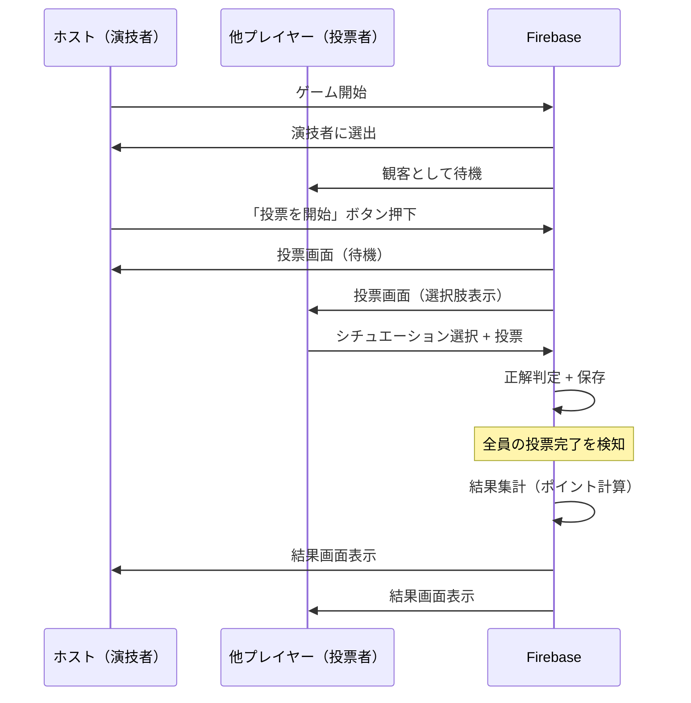

# 🗳️ デマーシア投票システム完全実装

## 🎯 実装完了した機能

「デマーシアに心を込めて」モードの投票システムを完全に実装しました。

### ✅ 修正・実装内容

1. **投票データの一貫性**
   - 投票データを `currentVotes` パスに統一
   - 投票時に正解/不正解を即座に判定・保存

2. **投票フローの完全実装**
   - 演技終了ボタン → 投票フェーズ開始 → 全員が投票 → 自動で結果表示
   - 演技者は投票不要（待機画面を表示）
   - 投票完了後はボタンを無効化

3. **結果表示の強化**
   - 各投票者の選択内容を表示
   - 正解/不正解を色分け表示（緑/赤）
   - 演技者の獲得ポイントを表示
   - 正解者数の集計表示

4. **自動集計システム**
   - 全員の投票完了を自動検知
   - 即座に結果を集計してFirebaseに保存
   - 全員の画面が自動で結果画面に遷移

## 📋 実装ファイル

### 1. js/demacia-game.js

#### 新規メソッド: `submitVote`
```javascript
async submitVote(voterName, guessedSituationIndex) {
  // 選択されたシチュエーションと正解を比較
  // 投票データをFirebaseに保存
  // 全員の投票完了をチェック
}
```

#### 新規メソッド: `checkVotingComplete`
```javascript
async checkVotingComplete() {
  // 演技者を除く全員が投票したかチェック
  // 完了していれば自動で結果集計
}
```

#### 改善メソッド: `calculateResults`
```javascript
async calculateResults() {
  // 投票結果を集計
  // 各投票者の正解/不正解を判定
  // 演技者にポイント付与
  // roundResultsにデータを保存
}
```

### 2. js/main.js

#### 新規関数: `startDemaciaVoting`
```javascript
async function startDemaciaVoting() {
  // 演技者のみが実行可能
  // Firebaseに投票状態を保存
  // 全員の画面を投票画面に遷移
}
```

#### 改善関数: `confirmDemaciaVote`
```javascript
async function confirmDemaciaVote() {
  // 投票ボタンを無効化
  // 投票データを送信
  // 待機メッセージを表示
  // エラー時は再有効化
}
```

#### 改善関数: `showDemaciaRoundResult`
```javascript
function showDemaciaRoundResult() {
  // セリフと正解シチュエーションを表示
  // 正解者数を表示
  // 演技者の獲得ポイントを表示
  // 各投票者の結果を一覧表示（色分け）
}
```

### 3. index.html

#### 追加要素: 投票者結果コンテナ
```html
<div id="demacia-voter-results" class="voter-results-container"></div>
```

## 🎮 ゲームフロー



## 📊 データ構造

### Firebase: `demacia_rooms/{roomId}`

```javascript
{
  gameState: 'voting',  // または 'round_result'
  currentPerformer: 'Player1',
  currentPhrase: {
    text: 'デマーシアァァァァ！',
    character: 'ガレン',
    situations: [
      { id: 1, text: 'ペンタキルを決めた時', difficulty: 'easy' },
      // ... 他のシチュエーション
    ]
  },
  correctSituation: 0,  // 正解のシチュエーションインデックス
  
  // 投票データ
  currentVotes: {
    'Player2': {
      guessedSituationIndex: 0,
      guessedSituationText: 'ペンタキルを決めた時',
      isCorrect: true,
      timestamp: 1708012345678
    },
    'Player3': {
      guessedSituationIndex: 2,
      guessedSituationText: '悲しい時',
      isCorrect: false,
      timestamp: 1708012346789
    }
    // ...
  },
  
  // 結果データ
  roundResults: {
    performer: 'Player1',
    correctSituationIndex: 0,
    correctSituationText: 'ペンタキルを決めた時',
    correctVotes: 2,  // 正解者数
    totalVoters: 3,   // 総投票者数
    pointsEarned: 2,  // 演技者の獲得ポイント
    difficulty: 'easy',
    voterResults: [
      {
        name: 'Player2',
        guessedIndex: 0,
        guessedText: 'ペンタキルを決めた時',
        isCorrect: true
      },
      {
        name: 'Player3',
        guessedIndex: 2,
        guessedText: '悲しい時',
        isCorrect: false
      }
      // ...
    ]
  }
}
```

## 🎨 UI表示

### 投票画面（投票者）

```
┌────────────────────────────────┐
│      投票タイム                 │
├────────────────────────────────┤
│ セリフ: デマーシアァァァァ！    │
│ キャラクター: ガレン            │
├────────────────────────────────┤
│ 演技者はどのシチュエーション    │
│ を演じていましたか？            │
│                                │
│ ┌──────────────────────────┐  │
│ │ 1. ペンタキルを決めた時  │  │ ← クリックで選択
│ └──────────────────────────┘  │
│ ┌──────────────────────────┐  │
│ │ 2. ガレンに追われている時│  │
│ └──────────────────────────┘  │
│ ...                            │
│                                │
│ [      投票する      ]          │
└────────────────────────────────┘
```

### 投票画面（演技者）

```
┌────────────────────────────────┐
│      投票タイム                 │
├────────────────────────────────┤
│                                │
│  👀 他のプレイヤーの投票を      │
│     待っています...             │
│                                │
└────────────────────────────────┘
```

### 結果画面

```
┌────────────────────────────────┐
│      ラウンド結果               │
├────────────────────────────────┤
│ セリフ: デマーシアァァァァ！    │
│ キャラクター: ガレン            │
│                                │
│ 正解: ペンタキルを決めた時      │
│       (難易度: easy)            │
│                                │
│ ✅ 正解者: 2 / 3人              │
│ 🎭 Player1さんの獲得ポイント:   │
│    +2                          │
├────────────────────────────────┤
│      🗳️ 投票結果               │
│                                │
│ ┏━━━━━━━━━━━━━━━━━━━━━━━━┓  │
│ ┃ Player2                 ┃  │ ← 正解（緑背景）
│ ┃ ペンタキルを決めた時     ┃  │
│ ┃                  ✅ 正解 ┃  │
│ ┗━━━━━━━━━━━━━━━━━━━━━━━━┛  │
│                                │
│ ┏━━━━━━━━━━━━━━━━━━━━━━━━┓  │
│ ┃ Player3                 ┃  │ ← 不正解（赤背景）
│ ┃ 悲しい時                ┃  │
│ ┃                  ❌ 不正解┃  │
│ ┗━━━━━━━━━━━━━━━━━━━━━━━━┛  │
│                                │
│ [   次のラウンドへ   ]          │
└────────────────────────────────┘
```

## 🔧 動作確認手順

### 1. ルームを作成（3人以上）

1. ブラウザを3つ開く（または3つのデバイス）
2. Browser A: ルーム作成 → ルームID取得
3. Browser B, C: ルームIDで参加

### 2. ゲーム開始

1. Browser A（ホスト）: 「ゲーム開始」をクリック
2. 全員: 演技者選択画面へ遷移
3. ホスト: 「ランダム選択」をクリック

### 3. 演技フェーズ

1. 演技者: セリフとシチュエーションが表示される
2. 観客: 演技者名が表示される、シチュエーションは見えない
3. 演技者: 「投票を開始」ボタンをクリック

### 4. 投票フェーズ

1. **演技者**:
   - 画面: 「他のプレイヤーの投票を待っています...」
   - 投票ボタン: 非表示

2. **観客（Browser B）**:
   - 6つのシチュエーション選択肢が表示される
   - シチュエーション1を選択（ボタンが選択状態に）
   - 「投票する」ボタンをクリック
   - 画面: 「✅ 投票完了！ 他のプレイヤーの投票を待っています...」
   - コンソール: `✅ 投票送信完了`

3. **観客（Browser C）**:
   - 同様にシチュエーション3を選択
   - 「投票する」ボタンをクリック

### 5. 自動で結果画面へ遷移

1. **全員の投票が完了した瞬間**:
   - コンソール（全ブラウザ）: `🎉 全員の投票が完了！結果を集計します`
   - コンソール（全ブラウザ）: `✅ 結果集計完了`
   - 全員の画面が自動で結果画面に遷移

2. **結果画面の表示内容**:
   - セリフとキャラクター名
   - 正解シチュエーション（難易度付き）
   - 正解者数（例: 2 / 3人）
   - 演技者の獲得ポイント
   - **各投票者の結果一覧**:
     - Player2: ペンタキルを決めた時 ✅ 正解（緑背景）
     - Player3: 悲しい時 ❌ 不正解（赤背景）

### 6. コンソールログの確認

各段階で以下のログが表示されます：

```javascript
// 投票送信時
📤 投票送信中: Player2 → 0

// 投票保存時（demacia-game.js）
✅ 投票完了: Player2 → ペンタキルを決めた時 (正解)
📊 投票状況: 1/2

// 全員投票完了時
🎉 全員の投票が完了！結果を集計します
✅ 結果集計完了
📊 正解者: 2 / 2
🎁 演技者獲得ポイント: 2

// 結果表示時
📊 結果表示: {performer: 'Player1', correctVotes: 2, ...}
```

## 🐛 トラブルシューティング

### 投票ボタンが反応しない

**原因**: イベントリスナーが未登録

**解決策**:
1. コンソールを開く（F12）
2. `document.getElementById('demacia-submit-vote-btn')` を実行
3. null が返る場合はHTML要素が存在しない
4. 要素がある場合は、イベントリスナーを確認

### 投票しても結果画面に進まない

**原因**: `checkVotingComplete` が動作していない

**解決策**:
1. コンソールで `📊 投票状況:` ログを確認
2. 投票数が増えているか確認
3. Firebase Realtime Database で `currentVotes` を確認
4. 演技者も投票していないか確認（演技者は投票不要）

### 結果画面で「[Object Object]」と表示される

**原因**: データ構造の不一致（v1.0.11で修正済み）

**解決策**:
1. ブラウザをスーパーリロード（Ctrl+Shift+R）
2. バージョンが1.0.11以降か確認
3. `roundResults` オブジェクトの構造を確認

### 投票者の結果が表示されない

**原因**: HTML要素 `demacia-voter-results` が存在しない

**解決策**:
1. `index.html` line 553付近を確認
2. `<div id="demacia-voter-results"></div>` が存在するか確認
3. 存在しない場合は追加してリロード

## 📈 ポイント計算ルール

```javascript
const difficultyPoints = {
  easy: 1,    // 簡単: 1ポイント
  medium: 2,  // 普通: 2ポイント
  hard: 3     // 難しい: 3ポイント
};

// 演技者の獲得ポイント = 正解者数 × 難易度ポイント
// 例: 
// - 正解者3人 × easy(1) = 3ポイント
// - 正解者2人 × medium(2) = 4ポイント
// - 正解者1人 × hard(3) = 3ポイント
```

## 🎯 実装のポイント

### 1. 投票の即時判定
投票時に正解/不正解を判定して保存するため、結果集計が高速。

### 2. 自動進行
全員の投票完了を自動検知し、結果画面に遷移。手動操作不要。

### 3. リアルタイム同期
Firebaseのリアルタイム同期により、全員の画面が同時に更新。

### 4. ユーザビリティ
- 投票後はボタンを無効化（二重投票防止）
- 投票完了メッセージを表示（状態を明確化）
- 色分け表示で結果を直感的に理解

## ✅ 完了チェックリスト

- [x] 投票データの保存パスを統一
- [x] 投票時の正解判定実装
- [x] 全員の投票完了を自動検知
- [x] 結果の自動集計
- [x] 結果画面の投票者一覧表示
- [x] 正解/不正解の色分け表示
- [x] 演技者の投票スキップ
- [x] 投票ボタンの無効化/有効化
- [x] エラーハンドリング
- [x] コンソールログの追加

---

**実装完了日**: 2026年2月14日  
**バージョン**: 1.0.12 (予定)
